# MultiTetris-JS

Мультиплеерная веб-игра по мотивам классического Тетриса, разработанная с использованием React, TypeScript и WebSockets. Игра включает несколько режимов: одиночный, сражение на очки и королевская битва.

## Лабораторная работа №7 - роутинг

## Установка

### Установить зависимости (в корне MultiTetris-JS)
npm install

### Запустить приложение (в MultiTetris-JS/apps/client)
npm run dev
зайти на http://localhost:5173/

### Запуск тестов и линта (централизованно в корне MultiTetris-JS)
npm run lint
npm run test
npm run test:coverage

## Роутинг и страницы

### / - Главная страница

Краткое описание проекта и навигация по режимам игры.

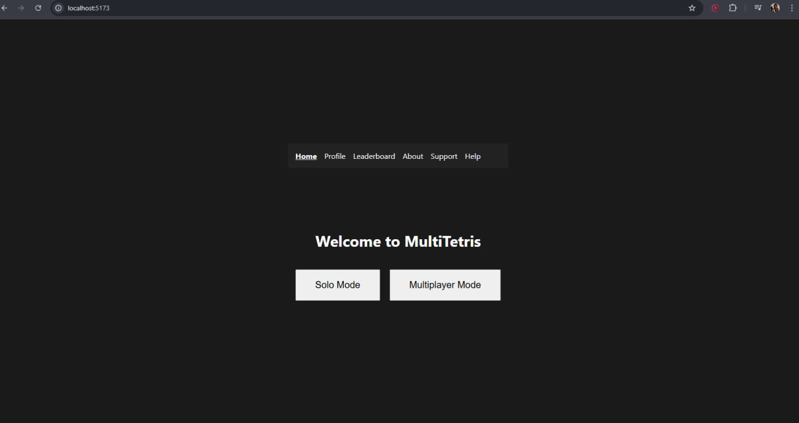

### /profile - Профиль пользователя

Показывает информацию о пользователе, статистику и настройки.

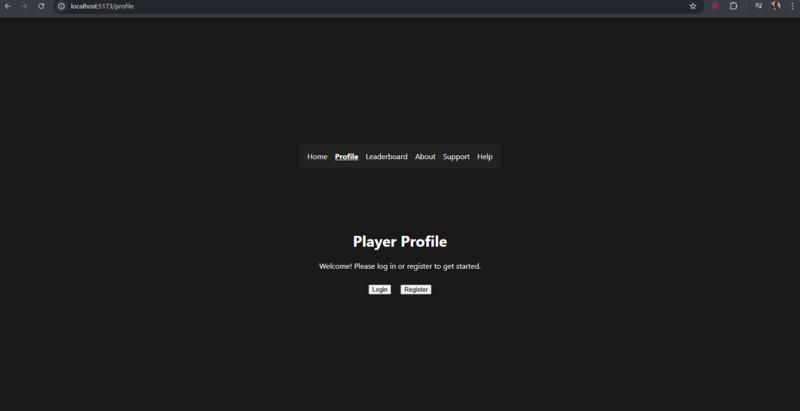

### /login - Вход и /register - Регистрация

Формы для входа и создания аккаунта.

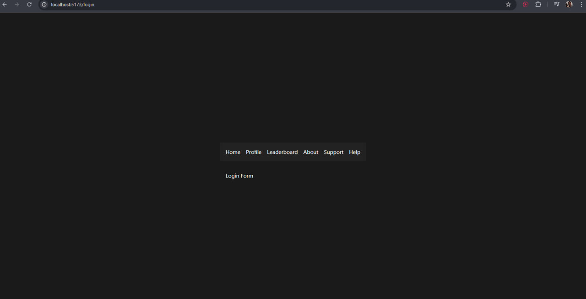

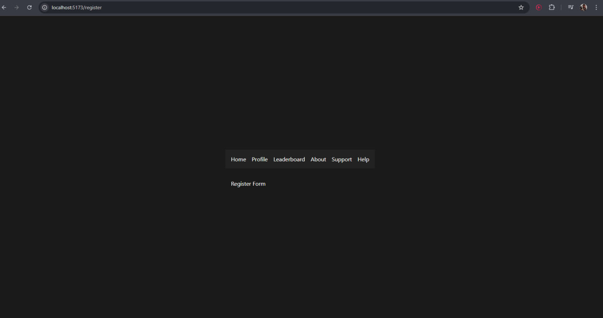

### /help - Помощь и /about - О проекте

Информационные страницы с правилами игры и описанием.

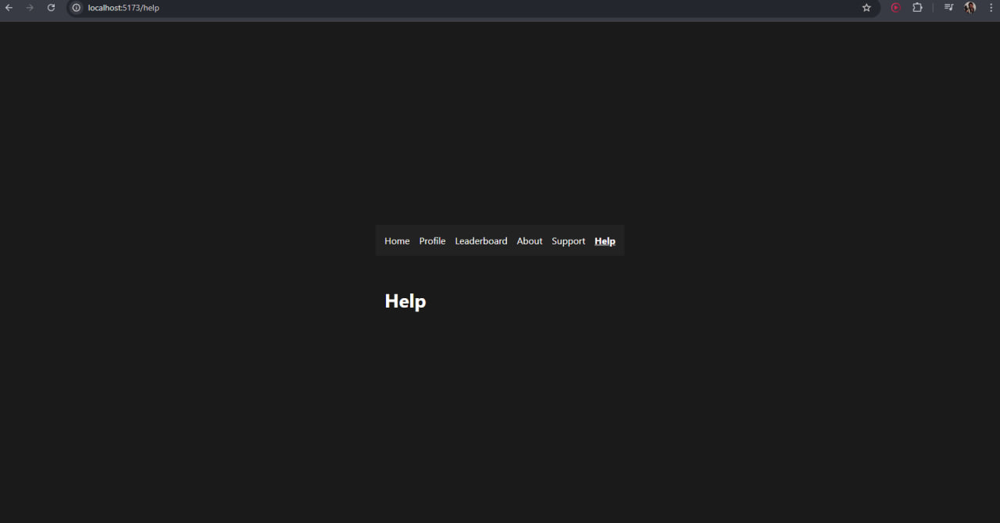

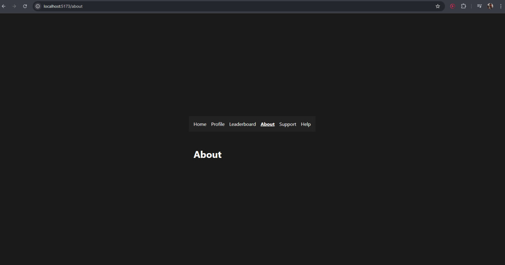

### /solo - Одиночная игра

Режим игры против себя на время и очки.

### /multiplayer - страница выбора мультиплеерного режима

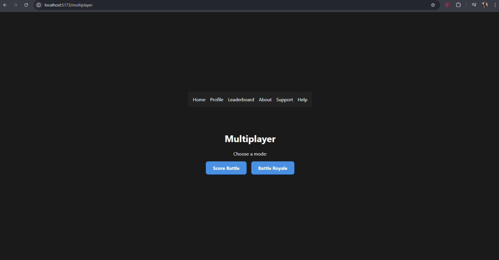

### /multiplayer/score - Сражение на очки

Игроки играют одновременно, выигрывает набравший больше очков.

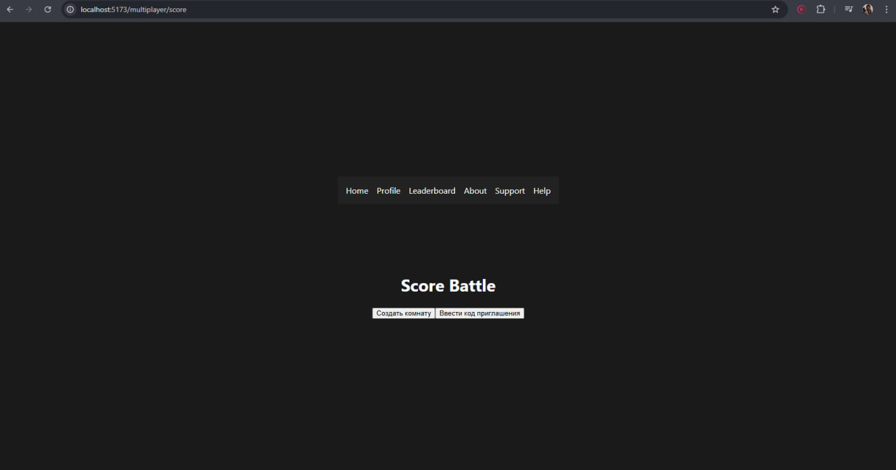

### /multiplayer/royale - Королевская битва

Один остается победителем. Игроки выбывают по мере поражения.

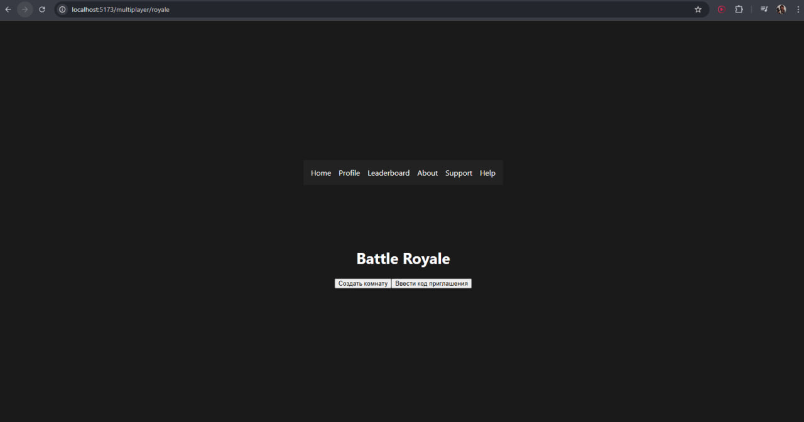

### /leaderboard - Таблица лидеров с фильтрами (по режиму, периоду)

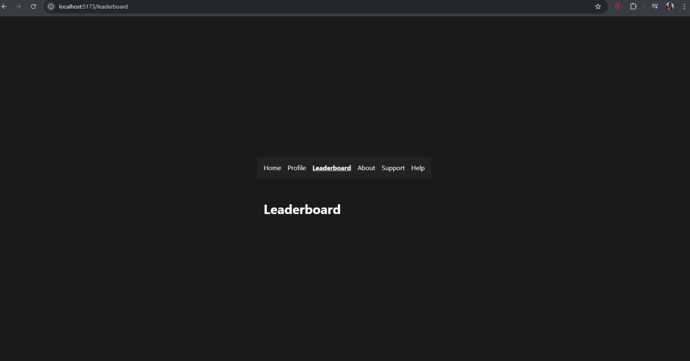

### (или /404) - Страница не найдена

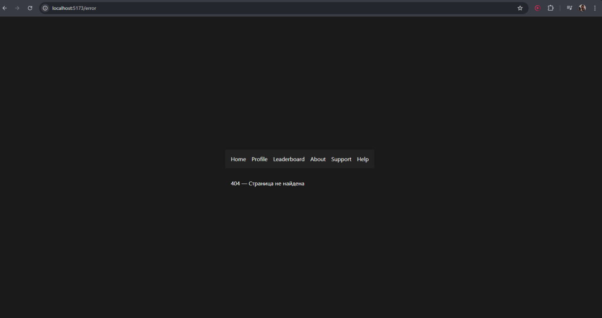

### /room/:mode/:id - Игровая комната (по ID и режиму)

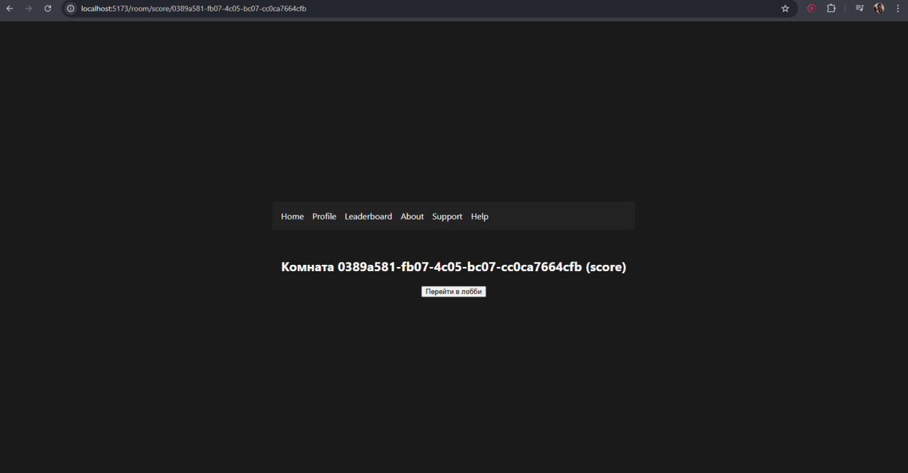

### /invite/:token - Приватное приглашение в комнату

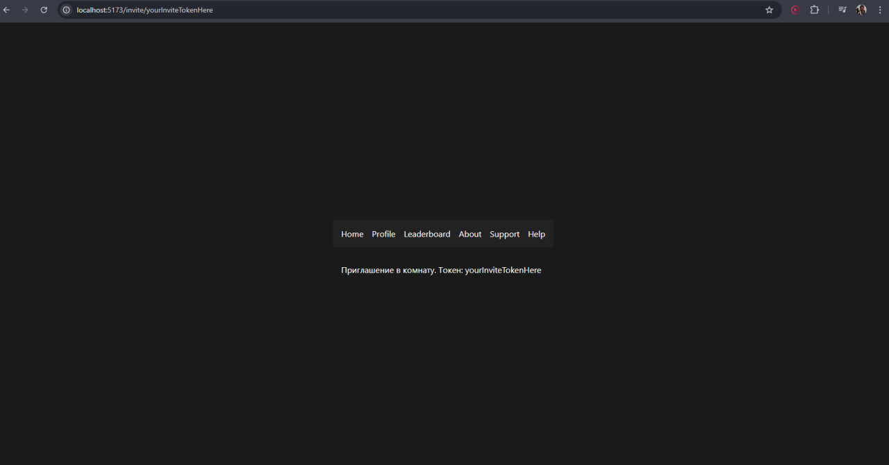

### /room/:mode/:id//lobby - Игровое лобби

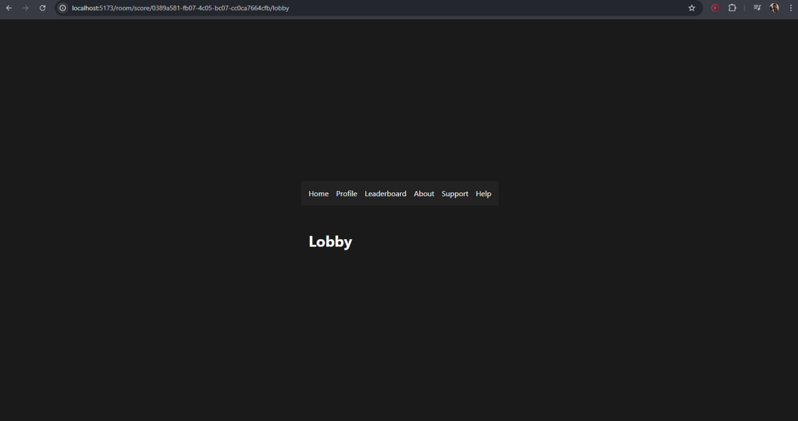